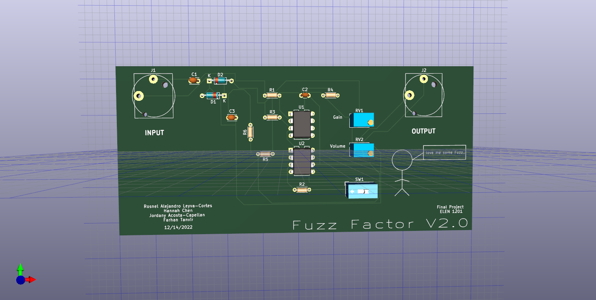

# GuitarPedalProject
Final Project for Intro to EE ELEN1201

project I worked on for my Intro to Electrical Engineering class. 
We built an effect pedal for a guitar, effectively a soft distortion for the sound. It was really fun to make and I made some really good friends! 

The full report is also available for further technical reading

